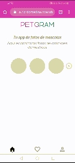

# Petgram progresive web app

Este repositorio contiene una app sencilla para ver fotos de mascotas, desarrollada con react-hooks.

[Ver la aplicación](https://react-advanced-rcrdmedina.ricrdomedina.now.sh/)

## Cómo funciona?

Requiere Node.JS 10

* `yarn` para instalar las dependencias.
* `yarn dev` para el entorno de desarrollo.
* `yarn build` para el entorno de producción.

## Licencia 

MIT
